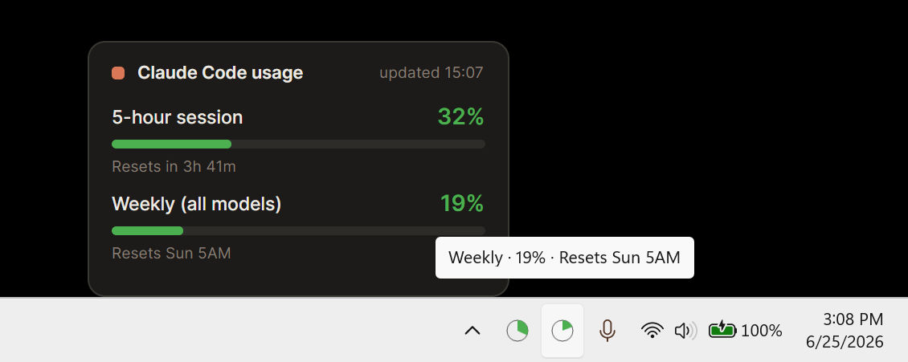

# Claude Code Usage Monitor

Claude Code usage limits always visible in the system tray.


A lightweight tray app that shows your Claude Code session limits so they stay at a glance while you work.

Works on Windows 11/10. macOS and Linux are planned.



## Options / features

- Pick your limits (right-click): 5-hour, Weekly (all), Weekly (Sonnet).
- Hover for the exact figure: `5-hour · 82% · Resets in 2h 13m`.
- Right-click to open settings: toggle limits, force a refresh, start at login, open the config file.

## Your login stays yours

The app reads **your own** Claude Code login. The credentials the CLI already keeps at
`~/.claude/.credentials.json`. Nothing to set up, nothing shared: it uses the same OAuth endpoint as the `claude` CLI and lets the CLI refresh its own token. Your credentials are never stored or sent anywhere. No telemetry, no analytics, no third-party calls.

## Install

**Windows:** grab the latest `CC-Usage-Monitor.exe` from
[Releases](https://github.com/bitlamas/cc-usage-monitor/releases) and run it — no install needed.

**From source** (requires the [.NET 8 SDK](https://dotnet.microsoft.com/download)):

```bash
git clone https://github.com/bitlamas/cc-usage-monitor.git
cd cc-usage-monitor
dotnet run --project src/CcUsageMonitor
```

## Configuration

Settings live in a per-user `config.json` — open it straight from the right-click menu.

| OS | Path |
|----|------|
| Windows | `%APPDATA%\cc-usage-monitor\config.json` |
| macOS | `~/Library/Application Support/cc-usage-monitor/config.json` |
| Linux | `~/.config/cc-usage-monitor/config.json` |

The file defines which limits show, the warn/alert thresholds, poll interval, and disc colors. Invalid values fall back to sensible defaults.

## Built with

C# / .NET 8 · [Avalonia UI](https://avaloniaui.net/) 11.2 for the cross-platform tray ·
[SkiaSharp](https://github.com/mono/SkiaSharp) 2.88 for the disc rendering.

## License

[GNU GPLv3](LICENSE)
